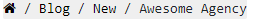

# List of function


## showMainMenu()

`showMainMenu()` function is used for calling main menu.

```php
<?php
	showMainMenu($menuArray, array('submenu'=>FALSE), segment(1));
?>
```


<br>
<strong>Parameter</strong>

<ul>
	<li>
		<strong>$menuArray</strong> is a multidimensional associative array.It has several key like - <strong>m_title , m_link , m_id , parent , m_alias , m_view , submenu</strong>
    </li> 
	<li><strong>array(‘submenu’ => false)</strong> is also a associative array that check main menu has a submenu or not. Initially submenu assign a false value.</li>
	<li><strong>segment(n)</strong> allow to retrieve a specific segment form URI string where (n) is a segment number. Segments are numbered from left to right.</li>

<br>
<strong>Example</strong><br>

**http://www.domainname.com/index.php/blog/language/php/function**

```php 
echo $this->uri->segment(1);       //it will print blog
```  

```php
echo $this->uri->segment(2);       //it will print language
```

</ul>


<br>
<strong>How it Works</strong>

```php
function showMainMenu($menu, $options='', $c_active=''){
	<!-- if submenu exists then it'll open <ul> tag with .dropdown-menu 
	     or <ul> tag with .nav .navbar-nav class --> 
    if($options == 1){                          
		echo '<ul class="dropdown-menu">'; 
	}else{                                    
		echo '<ul class="nav navbar-nav">';
	}

    <!-- $menu will be check through foreach loop where $i is key
          and $item is value -->
	foreach($menu as $i => $item){
		$lnk = $item['m_alias']; 

		if($item['m_view'] == 'category'): 
			$lnk = $item['m_link'];      
		endif;

        <!-- if submenu is not empty it'll open <li> with .dropdown 
             and <a> with .dropdown-toggle -->
        if( !empty($item['submenu']) ): 
			$options=1;   <!-- option is true -->     
			echo '<li class="dropdown"><a  class="dropdown-toggle" data-toggle="dropdown" href="#">' . $item['m_title'] . ' <span class="caret"></span></a>';

        <!-- if m_alias equals to home, then it'll open <li> and <a> tag -->
		elseif($item['m_alias'] == 'home'):        
			echo ' <li><a href="'.base_url().'">' . $item['m_title'] . '</a>';


        <!-- if $c_active equals to $item['m_alias'] then it'll open <li> with .active 
             and <a> tag otherwise it'll open <li> then <a> tag -->
		elseif($c_active == $item['m_alias']):    
			echo ' <li class="active"><a href="'.base_url().$lnk.'">' . $item['m_title'] . '</a>';

		else:
			echo ' <li><a href="'.base_url().$lnk.'">' . $item['m_title'] . '</a>';
		endif;

        <!-- If submenu is not empty then again it calls showMainMenu() function	-->
		if( !empty($item['submenu']) ){	   										
			showMainMenu($item['submenu'],$options, $c_active);
		}						
		echo '</li> ';
	}
	echo '</ul>';					
}
```


## showfooterMenu()
`showfooterMenu()` function is used for calling footer menu.

```php 
   <?php 
       showfooterMenu($item['m_alias']);
   ?>
```

<br>
<strong>How it works</strong>

```php
/* Footer Menu */
function showfooterMenu($menu , $dropdown = FALSE){
	echo '<ul class="footer-menu">';
		foreach($menu as $i => $item){
		     echo ' <li><a href="'.base_url().$item['m_alias'].'">' . $item['m_title'] . '</a>';

			if( !empty($item['submenu']) ){												
				showfooterMenu($item['submenu']);
			}						
			echo '</li> ';
		}
	echo '</ul>';		
}	
/* Footer Menu */
```


## showsideMenu()
`showsideMenu()` function is used for calling side menu.

<br>
<strong>How it works</strong>

```php
function showsideMenu($menu,$dropdown = FALSE){
	echo '<ul class="footer-menu">';
		foreach($menu as $i => $item){
				echo ' <li><a href="'.base_url().$item['m_alias'].'">' . $item['m_title'] . '</a>';				
			if( !empty($item['submenu']) ){												
				showsideMenu($item['submenu']);
			}						
			echo '</li> ';
		}
	echo '</ul>';		
}
```


## featuredimg()
`featuredimg()` function returns featured image.

```php
   <?php
       echo featuredimg($item['featuredimg'],$item['title']);
   ?>
```

<br>
<strong>How it works</strong>

```php

function featuredimg($imgs, $title='', $withimgtag = TRUE, $single = TRUE){	
	<!-- if $imgs match with `|` , then `|` will tranform into array -->
	if(preg_match('/|/',$imgs)){       
		$p_image = explode('|',$imgs); 
		<!-- if it is a single image, then it'll enter into next condition -->		
		if($single){        
            <!-- if image is with a tag then it'll return  tag with title or return no image -->
			if($withimgtag){     
				return ""; 
			}else{
				return $p_image[0];
			}
		}
        <!-- If it is not a single image, then $imgs will be empty array -->
	    else{           
			$imgs='';
			foreach($p_image as $img){
				<!-- $imgs.=""; -->
				$imgs.='<li><a data-image="'.$img.'" href="#"></a></li>';
			}
			return $imgs;	 <!-- return more than one image -->
		}								
	}
	<!-- if $imgs does not match with `|` -->
	else{    
		if($withimgtag){
			return "";
		}else{
			return $imgs;
		}
	}		
}
```


## share

```php
 function share($content){				
	if(count($content) == 1 ):
		
	echo '<a href="http://twitter.com/share?text='.$content[0]['title'].'&url='.base_url().'a/'.$content[0]['alias'].'" target="_blank"><i class="fa fa-twitter fa-lg"></i></a>

		<a href="http://www.facebook.com/sharer.php?u='.base_url().'a/'.$content[0]['alias'].'" target="_blank"><i class="fa fa-facebook-square fa-lg"></i></a>

		<a href="https://www.linkedin.com/shareArticle?mini=true&url='.base_url().'term/'.$content[0]['alias'].'&title='.$content[0]['title'].'" target="_blank"><i class="fa fa-linkedin-square fa-lg"></i></a>

		<a href="https://plus.google.com/share?url='.base_url().'a/'.$content[0]['alias'].'" target="_blank"><i class="fa fa-google-plus-square fa-lg"></i></a>';

	endif;
}
```


## index

```php
function index($content, $menucheck, $cat_list='', $breadcrumb='', $content_type='', $rating=''){
    $cnt=1;
	$cnt_1=1;
	$ac="active";		
	
	if(count($content)>0):			
	
	if(count($content) == 1 && $content_type!='multi'):
		echo '<article id="article-post"><div class="head-image thumb-wrap relative">';
		echo "<header>";
			content_util();
		echo "<div class=breadcrumb>".$breadcrumb."</div>";			
		echo '<span itemscope= itemtype="http://schema.org/WebPage">'; // SEO			
		echo '<h1 itemprop="name">'.$content[0]['title'].'</h1>';						
		echo '<span itemprop="starRating" itemscope itemtype="http://schema.org/Rating">'; //SEO
		echo "<div class='show-rate' style='clear:both; height:30px;'>".$rating."</div>";
		echo '</span></span>';
				
		//echo '<div style="width:100%; height:90px; background:#f7f7f7; margin-bottom:10px">Ads</div>';
		
		echo '</header>';
		
		if(!empty($content[0]['featuredimg'])):
        echo '<a href="'.base_url().$content[0]['cat_alias'].'/'.$content[0]['alias'].'"></a>';			          
		endif;			
					
		echo '<div class="fulltext">'.$content[0]['fulltexts'].'</div>';					
													
		echo "</article>";		
		
	 endif;
				
		
	else:
		echo '<p class="alert alert-warning"><i class="fa fa-exclamation-triangle"></i> Sorry There is no item under this category!</p>';
	endif;	
}
```

<br>
<strong>Parameter</strong>

<ul>
	<li><strong>$content </strong> - multidimensional associative array. Keys of this variable are </li>
</ul>

```php
[id] => 396
[title] => Awesome Agency
[alias] => home
[introtext] => Introtext will be here
[fulltexts] => Full content will be here
[featuredimg] => image location
[catid] => 0
[catlead] => 0
[hits] => 26
[attribs] => 
[created_by] => 36
[metakeys] => 
[metades] => 
[is_menu] => 1
[access] => 1
[status] => active
[created_at] => 2020-06-30 02:06:00
[r_catid] => 12
[r_aid] => 396
[r_catlead] => 0
[cat_id] => 12
[cat_title] => New
[cat_alias] => new
[cat_picture] => 
[cat_parent] => 1
[cat_description] => 
[cat_status] => active
[cat_date] => 2020-06-30 00:00:00
```

<ul>
	<li><strong>$menucheck </strong> - associative array.</li>
</ul>

```php
Array
(
    [m_view] => single
    [m_template] => default
    [m_link] => home
)
```

<ul>
	<li><strong>$catlist - </strong></li>
	<li><strong>$breadcrumb - </strong></li>
	<li><strong>$content_type</strong> - Type will be single or multiple</li>
	<li><strong>$rating - </strong></li>
</ul>

## content_util()
`content_util()` uses for printing share icon

```php
    function content_util(){
		echo "<div class='con_util'>";
		echo "<ul>";
			echo "<li><a href='".base_url().uri_string()."?print=1' target='_blank' rel='nofollow' class=''><i class='fa fa-print'></i></a></li>";
			echo "<li><a href='javascript:void(0)' class='in'><i class='fa fa-search-minus'></i></a></li>";
			echo "<li><a href='javascript:void(0)' class='de'><i class='fa fa-search-plus'></i></a></li>";
		echo "</ul>";
		
		echo "</div>";
	}
```

## breadcrumb()
`breadcrumb()` function return $breadcrumb html 

<br>
<strong>How to use</strong>

```php
<?php 
   echo $breadcrumb;
?>
```

<br>
<strong>Return something like the below image</strong>



<br>
<strong>How its work</strong>

```php
public function breadcrumb($id, $title=''){
	$catparent = $id;
	$breadcrumb = "<a href=".base_url()."><i class='fa fa-home'></i></a>";
	$bread_last = '';
	$c = 0;			
	
	do{					
		$rows = 'cat_title,cat_alias,cat_parent';
		$where = ['cat_id'=>$catparent,'cat_status'=>'active'];
		$ct = $this->apps->lselect('category', [ 'rows'=>$rows, 'where'=> $where ]);		
						
		$catparent = $ct[0]['cat_parent'];
			
		if($c!=0){
			$breadcrumb.=" / <a href=".base_url($ct[0]['cat_alias']).">".$ct[0]['cat_title']."</a>";	
		}elseif($ct[0]['cat_title']!='uncategorized'){
			$bread_last=" / <a href=".base_url('section/'.$ct[0]['cat_alias']).">".$ct[0]['cat_title']."</a>";
		}
		
		$c++;
	}while($catparent!='root');
	
	$breadcrumb .= !empty($title) ? $bread_last." / ".$title : $bread_last;
	
	return $breadcrumb;
}
```


## isset() 

Check whether a variable is empty. Also check whether the variable is set/declared


## form_open()

<h4>Parameters</h4>

**$action (string)** – Form action/target URI string (action=” http://localhost:8080/search”)

**$attributes (mixed)** – HTML attributes, as an array or escaped string (id, class, style)

**$hidden (array)** – An array of hidden fields’ definitions

<h4>Returns</h4>
An HTML form opening tag 


## form_input()

<h4>Parameters</h4>

**$data (array)** – Field attributes data

**$value (string)** – Field value

**$extra (mixed)** – Extra attributes to be added to the tag either as an array or a literal string

**$type (string)** – The type of input field. i.e. ‘text’, ‘email’, ‘number’, etc.

<h4>Returns</h4>
An HTML text input field tag


## form_dropdown()  

<h4>Parameters</h4>

**$name (string)** – Field name

**$options (array)** – An associative array of options to be listed

**$selected (array)** – List of fields to mark with the selected attribute

**$extra (mixed)** – Extra attributes to be added to the tag either as an array or a literal string

<h4>Returns</h4>
An HTML dropdown select field tag


## set_value()

<h5>Parameters</h5>

**$field (string)** – Field name

**$default (string)** – Default value

**$html_escape (bool)** – Whether to turn off HTML escaping of the value

<h5>Returns</h5> 
Field value


## listError() 

Returns an array of all the errors logged in the system


